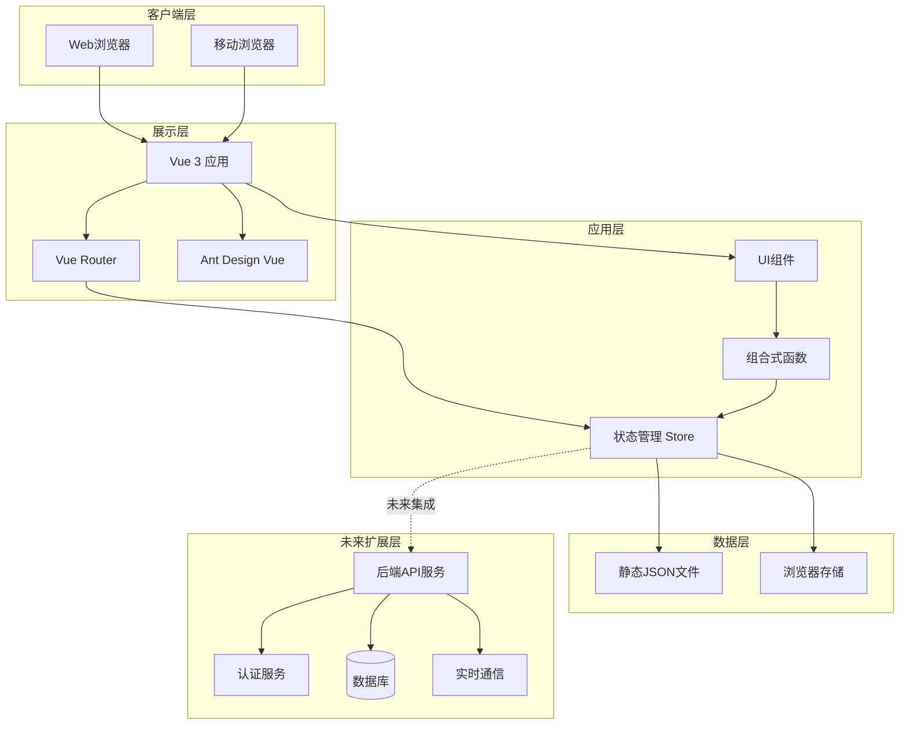
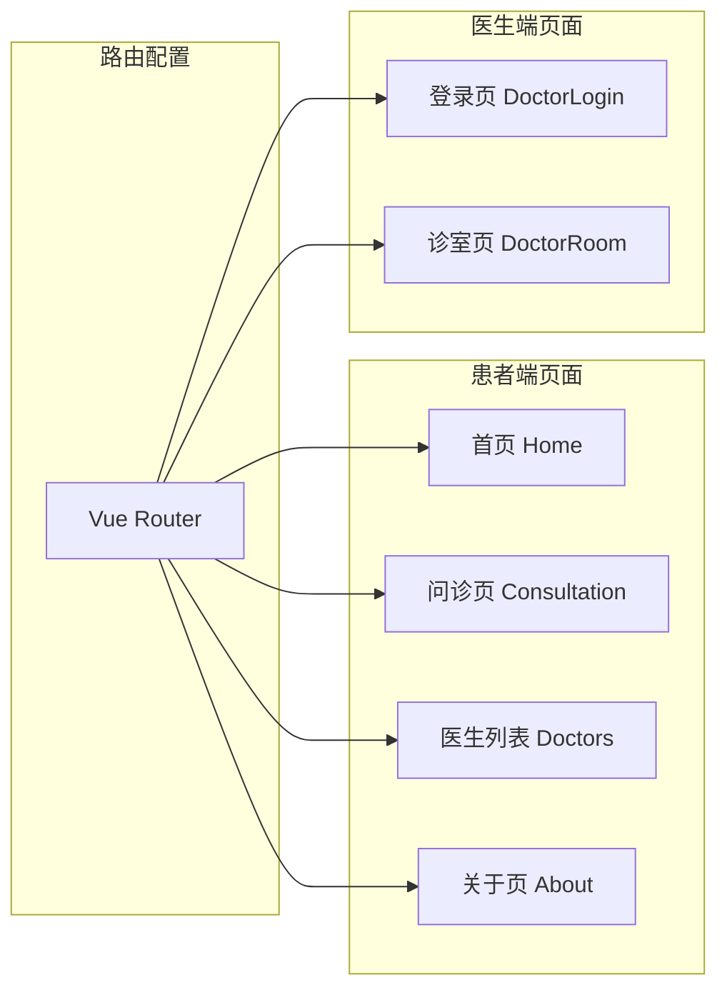
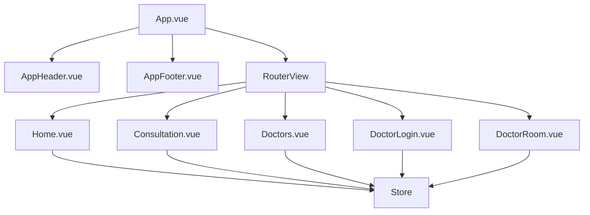
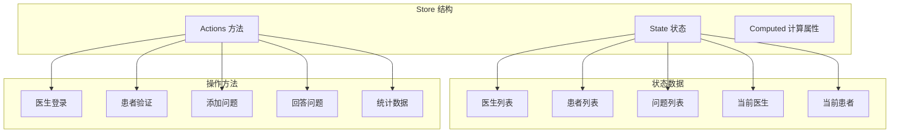
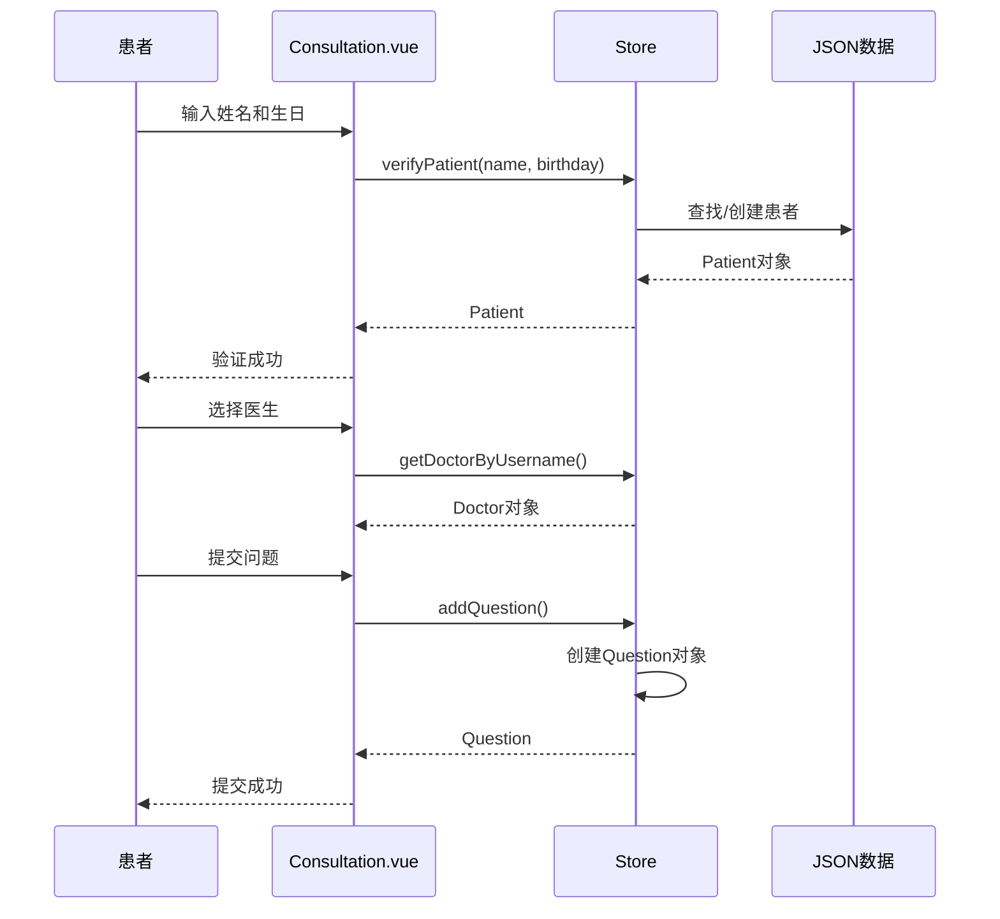
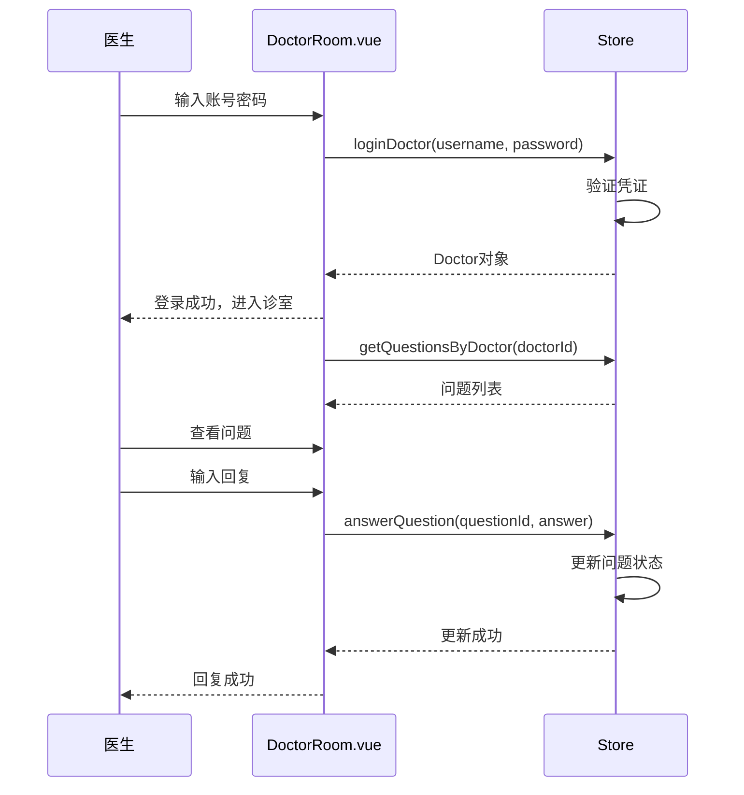
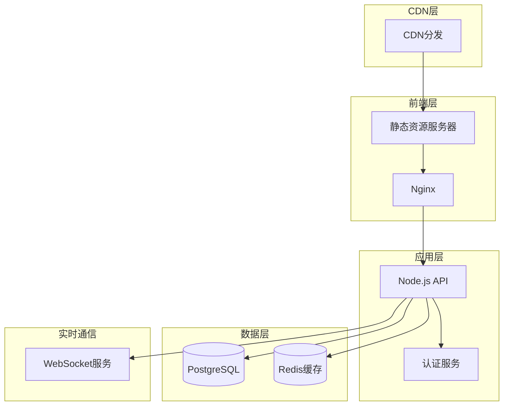
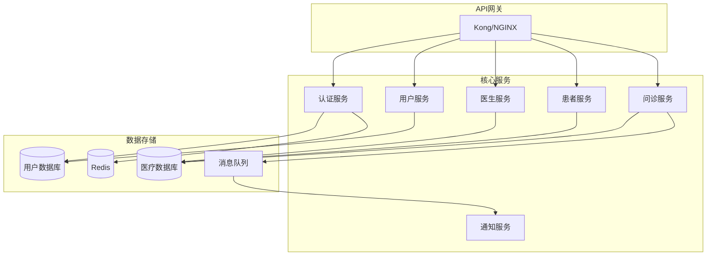

# 系统架构文档

## 概述

本文档描述了在线问诊平台（QA Live Healthcare）的整体系统架构、设计决策和技术模式。为 AI 模型提供系统结构和设计原则的全面理解。

---

## 架构概览

### 高层架构图



### 当前架构状态

**开发阶段**: 原型/演示阶段

**当前特点**:
- ✅ 纯前端单页面应用（SPA）
- ✅ 使用静态 JSON 文件模拟数据
- ✅ 客户端状态管理
- ⚠️ 无后端服务
- ⚠️ 无数据库持久化
- ⚠️ 无用户认证系统

---

## 架构原则

### 1. 关注点分离

```
┌─────────────────────────────────────────────────────────────┐
│  展示层 (Presentation Layer)                                │
│  - Vue 组件 (.vue 文件)                                     │
│  - 路由配置 (router/)                                       │
│  - UI 组件库集成 (Ant Design Vue)                           │
├─────────────────────────────────────────────────────────────┤
│  应用层 (Application Layer)                                 │
│  - 状态管理 (store/)                                        │
│  - 业务逻辑                                                 │
│  - 数据转换                                                 │
├─────────────────────────────────────────────────────────────┤
│  数据层 (Data Layer)                                        │
│  - 静态数据文件 (data/*.json)                               │
│  - 类型定义 (interfaces)                                    │
│  - 数据访问接口                                             │
└─────────────────────────────────────────────────────────────┘
```

### 2. 组件化架构

**组件分类**:

| 类别 | 目录 | 职责 | 示例 |
|------|------|------|------|
| 页面组件 | `src/views/` | 路由页面，业务逻辑 | `Home.vue`, `DoctorRoom.vue` |
| 通用组件 | `src/components/` | 可复用UI组件 | `AppHeader.vue`, `AppFooter.vue` |
| 布局组件 | `src/App.vue` | 应用布局框架 | 根组件 |

**组件通信模式**:
- 父子通信: Props / Emits
- 跨组件通信: Store（全局状态）
- 路由传参: Route Params / Query

### 3. 响应式设计原则

```typescript
// 响应式数据定义
const state = reactive<State>({
  doctors: doctorData as Doctor[],
  patients: patientData as Patient[],
  questions: questionData as Question[],
  currentDoctor: null,
  currentPatient: null,
});
```

---

## 技术栈详情

### 前端技术栈

| 技术 | 版本 | 用途 |
|------|------|------|
| Vue 3 | ^3.5.10 | 前端框架（Composition API） |
| TypeScript | ^5.5.3 | 类型安全 |
| Vite | ^5.4.8 | 构建工具 |
| Vue Router | ^4.6.3 | 路由管理 |
| Ant Design Vue | ^4.2.6 | UI组件库 |
| dayjs | ^1.11.19 | 日期处理 |

### 技术选型理由

**Vue 3 Composition API**:
```typescript
// 组合式函数示例
import { computed, ref, onMounted } from 'vue';
import { useRoute, useRouter } from 'vue-router';

export function useDoctorRoom() {
  const route = useRoute();
  const router = useRouter();
  const currentDoctor = computed(() => store.state.currentDoctor);
  
  onMounted(() => {
    if (!currentDoctor.value) {
      router.push('/doctor/login');
    }
  });
  
  return { currentDoctor };
}
```

**Vite 优势**:
- 快速冷启动
- 即时热模块替换（HMR）
- 优化的生产构建
- TypeScript 原生支持

---

## 组件架构

### 页面组件结构



### 路由配置

```typescript
// src/router/index.ts
const routes: RouteRecordRaw[] = [
  { path: '/', name: 'Home', component: Home },
  { path: '/consultation', name: 'Consultation', component: Consultation },
  { path: '/consultation/:doctorUsername', name: 'ConsultationRoom', component: Consultation },
  { path: '/doctors', name: 'Doctors', component: Doctors },
  { path: '/about', name: 'About', component: About },
  { path: '/doctor/login', name: 'DoctorLogin', component: DoctorLogin },
  { path: '/doctor/room/:username', name: 'DoctorRoom', component: DoctorRoom },
];
```

### 组件依赖关系



---

## 状态管理架构

### Store 设计



### Store 接口定义

```typescript
interface State {
  doctors: Doctor[];
  patients: Patient[];
  questions: Question[];
  currentDoctor: Doctor | null;
  currentPatient: Patient | null;
}

interface Doctor {
  id: string;
  username: string;
  password: string;
  name: string;
  title: string;
  department: string;
  avatar: string;
  experience: string;
  specialties: string[];
  isActive: boolean;
}

interface Patient {
  id: string;
  name: string;
  birthday: string;
  phone: string;
  gender: string;
}

interface Question {
  id: string;
  patientId: string;
  patientName: string;
  doctorId: string;
  doctorName: string;
  question: string;
  submitTime: string;
  status: 'pending' | 'answered';
  answer: string | null;
  answerTime: string | null;
}
```

### Store 方法概览

| 方法 | 参数 | 返回值 | 描述 |
|------|------|--------|------|
| `loginDoctor` | username, password | Doctor \| null | 医生登录验证 |
| `logoutDoctor` | - | void | 医生登出 |
| `verifyPatient` | name, birthday | Patient | 患者身份验证 |
| `logoutPatient` | - | void | 患者登出 |
| `getQuestionsByDoctor` | doctorId | Question[] | 获取医生的问题列表 |
| `getQuestionsByPatient` | patientId | Question[] | 获取患者的问题列表 |
| `addQuestion` | question data | Question | 添加新问题 |
| `answerQuestion` | questionId, answer | void | 回答问题 |
| `markQuestionAsAnswered` | questionId | void | 标记为已解答 |
| `getDoctorByUsername` | username | Doctor \| undefined | 按用户名获取医生 |
| `getActiveDoctors` | - | Doctor[] | 获取活跃医生列表 |
| `getStatistics` | - | Statistics | 获取统计数据 |

---

## 数据流架构

### 患者问诊流程



### 医生诊疗流程



---

## 设计模式应用

### 1. 单例模式（Store）

```typescript
// 全局唯一的 store 实例
export const store = {
  state,
  loginDoctor() { /* ... */ },
  // ...
};

// 在任何组件中使用同一个 store 实例
import { store } from '../store';
const currentDoctor = computed(() => store.state.currentDoctor);
```

### 2. 观察者模式（响应式系统）

```typescript
// Vue 的响应式系统自动实现观察者模式
const pendingQuestions = computed(() =>
  currentDoctor.value
    ? store.getQuestionsByDoctor(currentDoctor.value.id).filter(q => q.status === 'pending')
    : []
);

// 当 store.state.questions 变化时，pendingQuestions 自动更新
```

### 3. 工厂模式（问题创建）

```typescript
addQuestion(question: Omit<Question, 'id' | 'submitTime' | 'status' | 'answer' | 'answerTime'>): Question {
  const newQuestion: Question = {
    ...question,
    id: `q${Date.now()}`,         // 自动生成ID
    submitTime: new Date().toISOString(),  // 自动设置时间
    status: 'pending',            // 默认状态
    answer: null,                 // 初始化
    answerTime: null,
  };
  state.questions.push(newQuestion);
  return newQuestion;
}
```

### 4. 策略模式（认证方式）

```typescript
// 医生认证策略
loginDoctor(username: string, password: string): Doctor | null {
  const doctor = state.doctors.find(
    d => d.username === username && d.password === password
  );
  if (doctor) {
    state.currentDoctor = doctor;
    return doctor;
  }
  return null;
}

// 患者认证策略（不同方式）
verifyPatient(name: string, birthday: string): Patient {
  let patient = state.patients.find(
    p => p.name === name && p.birthday === birthday
  );
  
  if (!patient) {
    // 自动创建新患者
    patient = { id: `patient${Date.now()}`, name, birthday, phone: '', gender: '' };
    state.patients.push(patient);
  }
  
  state.currentPatient = patient;
  return patient;
}
```

---

## 安全架构

### 当前安全状态

| 安全措施 | 状态 | 说明 |
|----------|------|------|
| 密码加密 | ❌ 未实现 | 明文存储密码 |
| HTTPS | ⚠️ 部署时需要 | 开发环境使用HTTP |
| XSS防护 | ✅ Vue自动处理 | 模板自动转义 |
| CSRF防护 | ❌ 未实现 | 无后端Token机制 |
| 输入验证 | ⚠️ 基础验证 | 仅前端验证 |
| 权限控制 | ⚠️ 基础实现 | 路由守卫 |

### 安全风险分析

```typescript
// ⚠️ 当前风险：明文密码
export interface Doctor {
  username: string;
  password: string;  // 明文存储，危险！
  // ...
}

// ✅ 改进方案：使用后端认证
async function loginDoctor(username: string, password: string): Promise<AuthResult> {
  const response = await fetch('/api/auth/doctor/login', {
    method: 'POST',
    headers: { 'Content-Type': 'application/json' },
    body: JSON.stringify({ username, password })
  });
  
  const { token, doctor } = await response.json();
  localStorage.setItem('token', token);
  return doctor;
}
```

---

## 性能优化架构

### 当前优化措施

1. **代码分割**（Vite 自动处理）
```typescript
// 路由懒加载
const DoctorRoom = () => import('../views/DoctorRoom.vue');
```

2. **响应式优化**
```typescript
// 使用 computed 缓存计算结果
const pendingQuestions = computed(() => /* ... */);
```

3. **组件按需加载**（Ant Design Vue）
```typescript
import { Button, Modal, Input } from 'ant-design-vue';
```

### 建议优化措施

```typescript
// 1. 虚拟滚动（长列表）
import { VirtualList } from 'ant-design-vue';

// 2. 图片懒加载


// 3. 防抖/节流
import { debounce } from 'lodash-es';
const searchDoctor = debounce((keyword) => {
  // 搜索逻辑
}, 300);

// 4. 缓存策略
const cache = new Map();
function getCachedDoctor(id: string) {
  if (cache.has(id)) return cache.get(id);
  const doctor = store.getDoctorByUsername(id);
  cache.set(id, doctor);
  return doctor;
}
```

---

## 部署架构

### 当前部署方式

```yaml
# 静态文件部署
构建命令: npm run build
输出目录: dist/
部署方式: 静态文件托管（Nginx/Vercel/Netlify）
```

### 推荐生产架构



### Docker 部署配置

```dockerfile
# 前端容器
FROM node:20-alpine AS builder
WORKDIR /app
COPY package*.json ./
RUN npm ci
COPY . .
RUN npm run build

FROM nginx:alpine
COPY --from=builder /app/dist /usr/share/nginx/html
COPY nginx.conf /etc/nginx/nginx.conf
EXPOSE 80
CMD ["nginx", "-g", "daemon off;"]
```

### Nginx 配置

```nginx
server {
    listen 80;
    server_name healthcare.example.com;
    
    root /usr/share/nginx/html;
    index index.html;
    
    # SPA路由支持
    location / {
        try_files $uri $uri/ /index.html;
    }
    
    # API代理
    location /api/ {
        proxy_pass http://api-server:3000;
        proxy_http_version 1.1;
        proxy_set_header Upgrade $http_upgrade;
        proxy_set_header Connection 'upgrade';
        proxy_set_header Host $host;
    }
    
    # 静态资源缓存
    location ~* \.(js|css|png|jpg|jpeg|gif|ico|svg)$ {
        expires 1y;
        add_header Cache-Control "public, immutable";
    }
}
```

---

## 扩展架构设计

### 微服务架构规划



### 实时通信架构

```typescript
// WebSocket 集成设计
import { io } from 'socket.io-client';

class RealtimeService {
  private socket: Socket;
  
  connect(token: string) {
    this.socket = io('wss://api.healthcare.com', {
      auth: { token }
    });
    
    this.socket.on('new_question', (question: Question) => {
      // 实时推送新问题
      store.addQuestion(question);
    });
    
    this.socket.on('question_answered', (data: AnswerData) => {
      // 实时推送回答
      store.updateQuestion(data);
    });
  }
  
  // 医生上线
  doctorOnline(doctorId: string) {
    this.socket.emit('doctor_online', { doctorId });
  }
  
  // 患者发送问题
  submitQuestion(question: QuestionData) {
    this.socket.emit('submit_question', question);
  }
}
```

### 数据库设计

```sql
-- 用户表
CREATE TABLE users (
    id UUID PRIMARY KEY DEFAULT gen_random_uuid(),
    username VARCHAR(50) UNIQUE NOT NULL,
    email VARCHAR(100) UNIQUE NOT NULL,
    password_hash VARCHAR(255) NOT NULL,
    role VARCHAR(20) NOT NULL CHECK (role IN ('doctor', 'patient', 'admin')),
    created_at TIMESTAMP DEFAULT CURRENT_TIMESTAMP,
    updated_at TIMESTAMP DEFAULT CURRENT_TIMESTAMP
);

-- 医生表
CREATE TABLE doctors (
    id UUID PRIMARY KEY REFERENCES users(id),
    name VARCHAR(100) NOT NULL,
    title VARCHAR(100),
    department VARCHAR(100),
    avatar VARCHAR(500),
    experience TEXT,
    is_active BOOLEAN DEFAULT false,
    created_at TIMESTAMP DEFAULT CURRENT_TIMESTAMP
);

-- 患者表
CREATE TABLE patients (
    id UUID PRIMARY KEY REFERENCES users(id),
    name VARCHAR(100) NOT NULL,
    birthday DATE,
    phone VARCHAR(20),
    gender VARCHAR(10),
    created_at TIMESTAMP DEFAULT CURRENT_TIMESTAMP
);

-- 问题表
CREATE TABLE questions (
    id UUID PRIMARY KEY DEFAULT gen_random_uuid(),
    patient_id UUID REFERENCES patients(id),
    doctor_id UUID REFERENCES doctors(id),
    content TEXT NOT NULL,
    status VARCHAR(20) DEFAULT 'pending',
    answer TEXT,
    answer_time TIMESTAMP,
    created_at TIMESTAMP DEFAULT CURRENT_TIMESTAMP
);

-- 索引
CREATE INDEX idx_questions_doctor ON questions(doctor_id, status);
CREATE INDEX idx_questions_patient ON questions(patient_id);
CREATE INDEX idx_doctors_active ON doctors(is_active);
```

---

## 监控与可观测性

### 推荐监控方案

```typescript
// 1. 错误监控（Sentry）
import * as Sentry from '@sentry/vue';

Sentry.init({
  dsn: 'YOUR_DSN',
  integrations: [new Sentry.BrowserTracing()],
  tracesSampleRate: 0.1,
});

// 2. 性能监控
const performanceObserver = new PerformanceObserver((list) => {
  for (const entry of list.getEntries()) {
    console.log('Performance:', entry.name, entry.duration);
  }
});
performanceObserver.observe({ entryTypes: ['measure', 'navigation'] });

// 3. 用户行为分析
class Analytics {
  trackEvent(category: string, action: string, label?: string) {
    // Google Analytics / 自定义埋点
    gtag('event', action, {
      event_category: category,
      event_label: label,
    });
  }
  
  trackPageView(page: string) {
    gtag('config', 'GA_MEASUREMENT_ID', { page_path: page });
  }
}
```

### 日志规范

```typescript
enum LogLevel {
  DEBUG = 'debug',
  INFO = 'info',
  WARN = 'warn',
  ERROR = 'error',
}

class Logger {
  log(level: LogLevel, message: string, data?: any) {
    const logEntry = {
      timestamp: new Date().toISOString(),
      level,
      message,
      data,
      userAgent: navigator.userAgent,
      url: window.location.href,
    };
    
    // 发送到日志服务
    if (level === LogLevel.ERROR) {
      Sentry.captureException(new Error(message), { extra: data });
    }
    
    console[level](message, data);
  }
}
```

---

## 技术债务与改进计划

### 当前技术债务

| 类别 | 问题 | 优先级 | 建议解决方案 |
|------|------|--------|--------------|
| 安全 | 密码明文存储 | 🔴 高 | 实现后端认证，使用bcrypt |
| 架构 | 无后端服务 | 🔴 高 | 搭建Node.js API服务 |
| 状态管理 | 简单store | 🟡 中 | 迁移到Pinia |
| 类型定义 | 分散定义 | 🟡 中 | 集中到 types/ 目录 |
| 测试 | 无测试 | 🟡 中 | 添加单元测试和E2E测试 |
| 样式 | 混合CSS | 🟢 低 | 迁移到Tailwind CSS |

### 迁移路线图

```
Phase 1 (1-2周): 基础设施
├── 搭建后端API服务
├── 数据库设计与迁移
└── 认证系统实现

Phase 2 (2-3周): 功能完善
├── 实时通信（WebSocket）
├── 文件上传（头像、附件）
└── 通知系统

Phase 3 (1-2周): 优化重构
├── 状态管理迁移（Pinia）
├── 添加测试
└── 性能优化

Phase 4 (持续): 运维监控
├── 监控系统
├── 日志收集
└── CI/CD流程
```

---

## 开发约定

### 文件命名规范

```
src/
├── views/           # 页面组件：PascalCase.vue
│   ├── Home.vue
│   └── DoctorRoom.vue
├── components/      # 通用组件：PascalCase.vue
│   ├── AppHeader.vue
│   └── QuestionCard.vue
├── store/           # 状态管理：camelCase.ts
│   └── index.ts
├── router/          # 路由配置：camelCase.ts
│   └── index.ts
├── data/            # 数据文件：kebab-case.json
│   ├── doctor-user-list.json
│   └── question-list.json
└── types/           # 类型定义：PascalCase.ts（未来）
    └── index.ts
```

### Git 分支策略

```
main          # 生产分支
├── develop   # 开发分支
│   ├── feature/xxx    # 功能分支
│   ├── bugfix/xxx     # Bug修复
│   └── refactor/xxx   # 重构分支
└── hotfix/xxx         # 紧急修复
```

---

## 参考资料

### 技术文档
- [Vue 3 官方文档](https://vuejs.org/)
- [Ant Design Vue](https://antdv.com/)
- [Vite 官方指南](https://vitejs.dev/)
- [TypeScript 手册](https://www.typescriptlang.org/docs/)

### 设计模式
- [Vue 设计模式](https://vuejs.org/guide/scaling-up/patterns.html)
- [前端架构设计](https://www.patterns.dev/)

---

*本架构文档应在系统重大变更时更新。使用 `/asdm-context-update` 命令保持文档时效性。*
