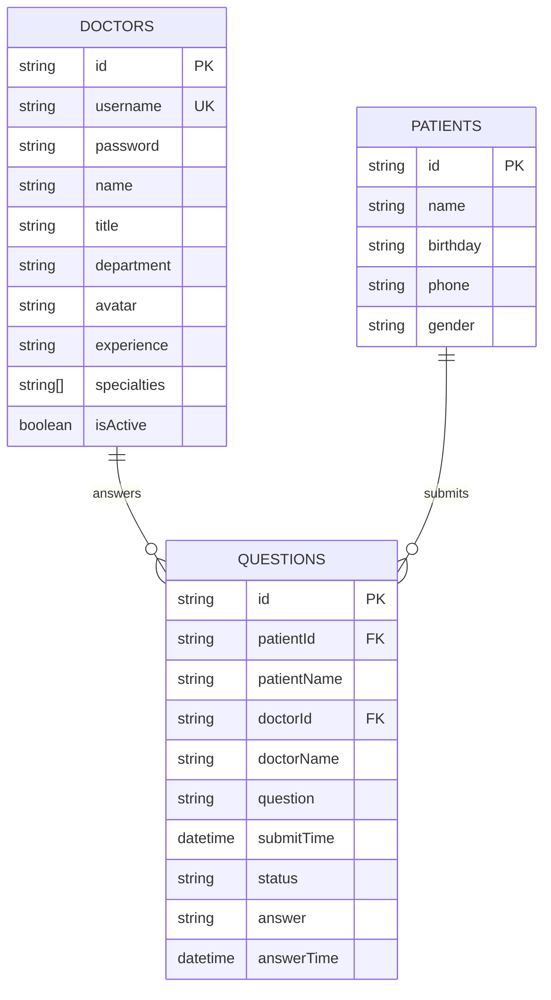
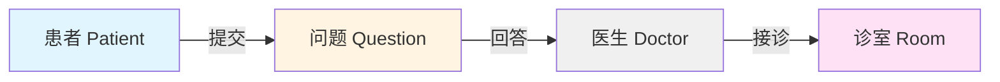
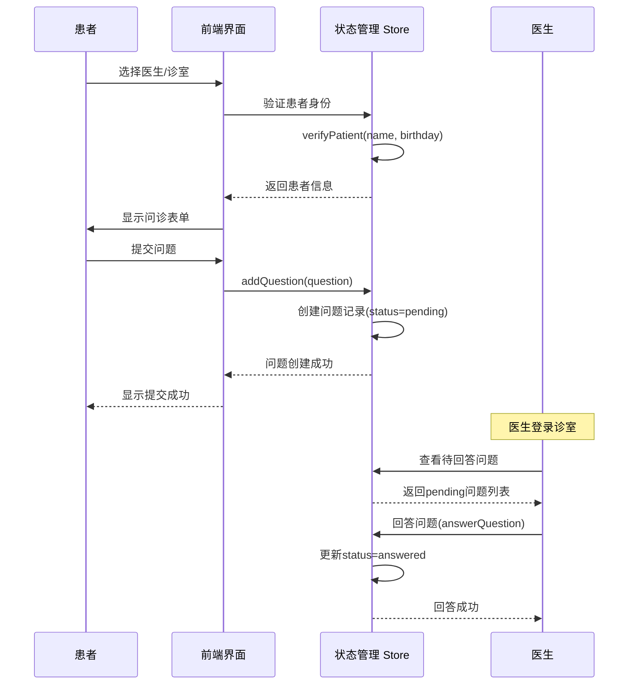
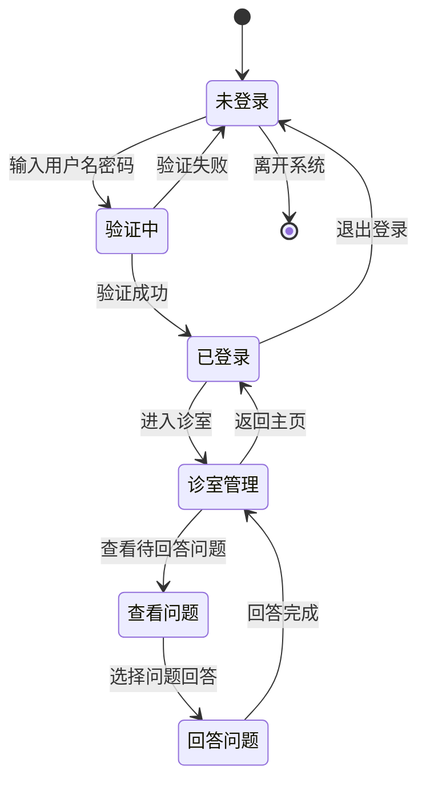
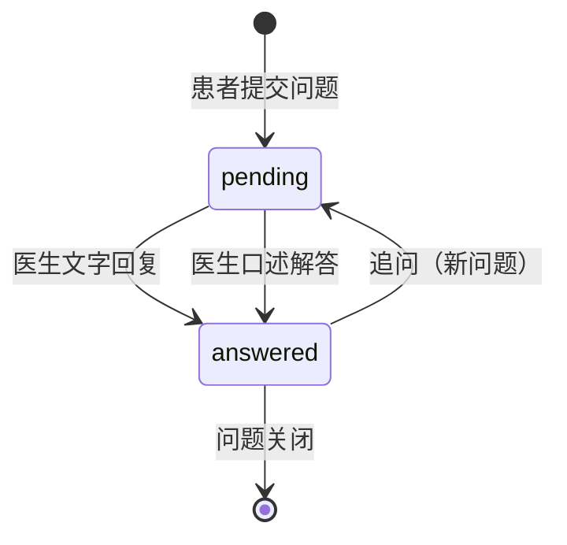

# 数据模型

## 概述
本文档描述了在线医疗问诊平台的数据模型、关系和数据流。它为AI模型提供了理解数据结构所需的信息，以便有效地操作代码库。

## 数据模型架构

### 整体架构图


## 实体定义

### 医生实体 (Doctor)
**用途**: 表示系统中的医生用户，包含认证信息和专业资料。

**源码位置**: [`src/store/index.ts:6-17`](../../src/store/index.ts)

```typescript
interface Doctor {
  id: string;              // 医生唯一标识符
  username: string;        // 登录用户名（唯一）
  password: string;        // 登录密码（明文存储，需改进）
  name: string;            // 医生姓名
  title: string;           // 职称（主任医师、副主任医师等）
  department: string;      // 所属科室
  avatar: string;          // 头像URL
  experience: string;      // 临床经验描述
  specialties: string[];   // 专业特长列表
  isActive: boolean;       // 是否在线/活跃状态
}
```

**数据约束**:
- `id`: 唯一标识符，格式为 `doc{数字}`（如 `doc001`）
- `username`: 唯一登录名，建议格式 `dr-{拼音姓名}`
- `password`: 当前为明文存储（**安全风险**，生产环境需要加密）
- `isActive`: 用于标识医生诊室是否开放接诊

**示例数据**:
```json
{
  "id": "doc001",
  "username": "dr-zhang-wei",
  "password": "123456",
  "name": "张伟医生",
  "title": "主任医师",
  "department": "心内科",
  "avatar": "https://images.pexels.com/photos/5215024/pexels-photo-5215024.jpeg",
  "experience": "15年临床经验",
  "specialties": ["高血压", "冠心病", "心律失常"],
  "isActive": true
}
```

### 患者实体 (Patient)
**用途**: 表示系统中的患者用户，用于身份验证和基本信息管理。

**源码位置**: [`src/store/index.ts:19-25`](../../src/store/index.ts)

```typescript
interface Patient {
  id: string;              // 患者唯一标识符
  name: string;            // 患者姓名
  birthday: string;        // 出生日期（YYYY-MM-DD格式）
  phone: string;           // 联系电话（可脱敏显示）
  gender: string;          // 性别
}
```

**数据约束**:
- `id`: 唯一标识符，格式为 `patient{数字}`（如 `patient001`）
- `birthday`: 用于身份验证和年龄计算
- `phone`: 可存储完整号码，显示时脱敏（如 `138****1234`）

**示例数据**:
```json
{
  "id": "patient001",
  "name": "赵明",
  "birthday": "1985-03-15",
  "phone": "138****1234",
  "gender": "男"
}
```

### 问题实体 (Question)
**用途**: 表示患者向医生提出的问诊问题及其回答状态。

**源码位置**: [`src/store/index.ts:27-38`](../../src/store/index.ts)

```typescript
interface Question {
  id: string;                    // 问题唯一标识符
  patientId: string;             // 提问患者ID
  patientName: string;           // 患者姓名（冗余字段，便于显示）
  doctorId: string;              // 接诊医生ID
  doctorName: string;            // 医生姓名（冗余字段，便于显示）
  question: string;              // 问题内容
  submitTime: string;            // 提交时间（ISO 8601格式）
  status: 'pending' | 'answered'; // 问题状态
  answer: string | null;         // 医生回答内容
  answerTime: string | null;     // 回答时间（ISO 8601格式）
}
```

**数据约束**:
- `id`: 唯一标识符，格式为 `q{数字}`（如 `q001`）
- `status`: 枚举值，`pending`（待回答）或 `answered`（已回答）
- `submitTime`/`answerTime`: ISO 8601格式的日期时间字符串
- `answer` 和 `answerTime`: 当状态为 `pending` 时为 `null`

**示例数据**:
```json
{
  "id": "q001",
  "patientId": "patient001",
  "patientName": "赵明",
  "doctorId": "doc001",
  "doctorName": "张伟医生",
  "question": "最近总是感觉胸闷气短，特别是爬楼梯的时候，这是什么原因？",
  "submitTime": "2025-11-02T09:30:00",
  "status": "answered",
  "answer": "根据您的描述，可能是心脏功能问题。建议您做个心电图和心脏彩超检查。",
  "answerTime": "2025-11-02T09:45:00"
}
```

## 数据关系

### 一对多关系

1. **Doctor → Questions (一对多)**
   - 一个医生可以回答多个问题
   - 通过 `doctorId` 外键关联
   - 访问方法: `store.getQuestionsByDoctor(doctorId)`

2. **Patient → Questions (一对多)**
   - 一个患者可以提交多个问题
   - 通过 `patientId` 外键关联
   - 访问方法: `store.getQuestionsByPatient(patientId)`

### 关系图示



## 数据流图

### 患者问诊流程


### 医生登录流程


## 数据验证规则

### 医生数据验证
```typescript
const doctorValidationRules = {
  username: {
    required: true,
    minLength: 3,
    maxLength: 50,
    pattern: /^dr-[a-z-]+$/,
    unique: true,
  },
  password: {
    required: true,
    minLength: 6,  // 生产环境应至少8位，包含大小写字母、数字、特殊字符
  },
  name: {
    required: true,
    minLength: 2,
    maxLength: 20,
  },
  title: {
    required: true,
    enum: ['主任医师', '副主任医师', '主治医师', '住院医师'],
  },
  department: {
    required: true,
  },
  specialties: {
    required: true,
    minItems: 1,
  },
};
```

### 患者数据验证
```typescript
const patientValidationRules = {
  name: {
    required: true,
    minLength: 2,
    maxLength: 20,
  },
  birthday: {
    required: true,
    pattern: /^\d{4}-\d{2}-\d{2}$/,
    validate: (value: string) => {
      const date = new Date(value);
      const now = new Date();
      return date < now && date > new Date('1900-01-01');
    },
  },
  phone: {
    required: false,
    pattern: /^1[3-9]\d{9}$/,
  },
  gender: {
    required: true,
    enum: ['男', '女'],
  },
};
```

### 问题数据验证
```typescript
const questionValidationRules = {
  patientId: {
    required: true,
    existsIn: 'patients',
  },
  doctorId: {
    required: true,
    existsIn: 'doctors',
  },
  question: {
    required: true,
    minLength: 10,
    maxLength: 1000,
  },
  answer: {
    required: false,
    maxLength: 2000,
    validateWhen: { status: 'answered' },
  },
};
```

## 数据访问层

### 状态管理接口

**源码位置**: [`src/store/index.ts:56-158`](../../src/store/index.ts)

#### 医生相关操作
```typescript
// 医生登录
store.loginDoctor(username: string, password: string): Doctor | null

// 医生登出
store.logoutDoctor(): void

// 根据用户名获取医生
store.getDoctorByUsername(username: string): Doctor | undefined

// 获取所有在线医生
store.getActiveDoctors(): Doctor[]

// 获取统计数据
store.getStatistics(): {
  totalDoctors: number;
  totalQuestions: number;
  activeSessions: number;
  totalSessions: number;
}
```

#### 患者相关操作
```typescript
// 患者身份验证
store.verifyPatient(name: string, birthday: string): Patient

// 患者登出
store.logoutPatient(): void
```

#### 问题相关操作
```typescript
// 添加问题
store.addQuestion(question: Omit<Question, 'id' | 'submitTime' | 'status' | 'answer' | 'answerTime'>): Question

// 回答问题
store.answerQuestion(questionId: string, answer: string): void

// 标记问题为已口头解答
store.markQuestionAsAnswered(questionId: string): void

// 获取医生的所有问题
store.getQuestionsByDoctor(doctorId: string): Question[]

// 获取患者的所有问题
store.getQuestionsByPatient(patientId: string): Question[]
```

## 数据存储方式

### 当前实现（原型阶段）
- **存储方式**: JSON文件
- **存储位置**: `src/data/` 目录
- **优点**: 简单快速，适合原型开发
- **缺点**: 
  - 无事务支持
  - 数据无法持久化（刷新页面后重置）
  - 无并发控制
  - 无数据索引

### 数据文件映射
| 数据类型 | 文件路径 | TypeScript接口 |
|---------|---------|---------------|
| 医生列表 | `src/data/doctor-user-list.json` | `Doctor[]` |
| 患者列表 | `src/data/patient-user.json` | `Patient[]` |
| 问题列表 | `src/data/question-list.json` | `Question[]` |

### 建议的数据库迁移方案

#### 关系型数据库（PostgreSQL/MySQL）
```sql
-- 医生表
CREATE TABLE doctors (
  id VARCHAR(20) PRIMARY KEY,
  username VARCHAR(50) UNIQUE NOT NULL,
  password_hash VARCHAR(255) NOT NULL,
  name VARCHAR(50) NOT NULL,
  title VARCHAR(20) NOT NULL,
  department VARCHAR(50) NOT NULL,
  avatar VARCHAR(500),
  experience VARCHAR(100),
  specialties JSONB,  -- PostgreSQL JSON类型存储数组
  is_active BOOLEAN DEFAULT true,
  created_at TIMESTAMP DEFAULT CURRENT_TIMESTAMP,
  updated_at TIMESTAMP DEFAULT CURRENT_TIMESTAMP
);

-- 患者表
CREATE TABLE patients (
  id VARCHAR(20) PRIMARY KEY,
  name VARCHAR(50) NOT NULL,
  birthday DATE NOT NULL,
  phone VARCHAR(20),
  gender VARCHAR(10) NOT NULL,
  created_at TIMESTAMP DEFAULT CURRENT_TIMESTAMP,
  updated_at TIMESTAMP DEFAULT CURRENT_TIMESTAMP
);

-- 问题表
CREATE TABLE questions (
  id VARCHAR(20) PRIMARY KEY,
  patient_id VARCHAR(20) NOT NULL REFERENCES patients(id),
  patient_name VARCHAR(50) NOT NULL,
  doctor_id VARCHAR(20) NOT NULL REFERENCES doctors(id),
  doctor_name VARCHAR(50) NOT NULL,
  question TEXT NOT NULL,
  submit_time TIMESTAMP NOT NULL,
  status VARCHAR(20) NOT NULL CHECK (status IN ('pending', 'answered')),
  answer TEXT,
  answer_time TIMESTAMP,
  created_at TIMESTAMP DEFAULT CURRENT_TIMESTAMP,
  updated_at TIMESTAMP DEFAULT CURRENT_TIMESTAMP
);

-- 索引优化
CREATE INDEX idx_questions_doctor_id ON questions(doctor_id);
CREATE INDEX idx_questions_patient_id ON questions(patient_id);
CREATE INDEX idx_questions_status ON questions(status);
CREATE INDEX idx_doctors_is_active ON doctors(is_active);
```

## 数据安全考虑

### 当前存在的安全问题
1. **密码明文存储**: 
   - 位置: `doctor-user-list.json`
   - 风险: 数据泄露会导致账户被盗
   - 解决方案: 使用 bcrypt 或 argon2 加密存储

2. **缺少认证令牌**:
   - 当前使用会话状态管理
   - 刷新页面需要重新登录
   - 解决方案: 实现 JWT 或 OAuth 认证

3. **无访问控制**:
   - 任何用户都可以访问所有数据
   - 解决方案: 实现基于角色的访问控制（RBAC）

### 建议的安全措施
```typescript
// 密码加密示例
import bcrypt from 'bcrypt';

async function hashPassword(password: string): Promise<string> {
  const saltRounds = 10;
  return await bcrypt.hash(password, saltRounds);
}

async function verifyPassword(
  password: string, 
  hash: string
): Promise<boolean> {
  return await bcrypt.compare(password, hash);
}

// 数据脱敏示例
function maskPhoneNumber(phone: string): string {
  return phone.replace(/(\d{3})\d{4}(\d{4})/, '$1****$2');
}
```

## 数据迁移策略

### 从JSON到数据库的迁移
```typescript
// 迁移脚本示例
async function migrateDataToDatabase() {
  // 1. 读取JSON数据
  const doctors = require('./src/data/doctor-user-list.json');
  const patients = require('./src/data/patient-user.json');
  const questions = require('./src/data/question-list.json');

  // 2. 转换数据格式
  for (const doctor of doctors) {
    await db.doctors.create({
      ...doctor,
      password_hash: await hashPassword(doctor.password),
      // 删除明文密码
      password: undefined,
    });
  }

  // 3. 验证数据完整性
  const migratedDoctors = await db.doctors.count();
  console.log(`迁移完成: ${migratedDoctors} 位医生`);
}
```

## 数据统计与查询

### 常用查询示例
```typescript
// 获取在线医生数量
const activeDoctors = store.getActiveDoctors().length;

// 获取待回答问题
const pendingQuestions = store.state.questions.filter(
  q => q.status === 'pending'
);

// 获取某医生的回答率
const doctorQuestions = store.getQuestionsByDoctor('doc001');
const answeredCount = doctorQuestions.filter(q => q.status === 'answered').length;
const answerRate = (answeredCount / doctorQuestions.length) * 100;

// 获取热门科室
const departmentCount = store.state.doctors.reduce((acc, doctor) => {
  acc[doctor.department] = (acc[doctor.department] || 0) + 1;
  return acc;
}, {} as Record<string, number>);
```

## 数据生命周期

### 问题状态流转


### 数据保留策略（建议）
- **活跃问题**: 保留在主表
- **已关闭问题**: 6个月后归档
- **医生数据**: 永久保留
- **患者数据**: 按照医疗数据保留法规执行

## 扩展建议

### 未来可添加的数据模型

1. **科室实体 (Department)**
```typescript
interface Department {
  id: string;
  name: string;
  description: string;
  icon: string;
  sortOrder: number;
}
```

2. **预约实体 (Appointment)**
```typescript
interface Appointment {
  id: string;
  patientId: string;
  doctorId: string;
  scheduledTime: Date;
  duration: number; // 分钟
  status: 'scheduled' | 'completed' | 'cancelled';
  notes: string;
}
```

3. **处方实体 (Prescription)**
```typescript
interface Prescription {
  id: string;
  questionId: string;
  patientId: string;
  doctorId: string;
  medications: Medication[];
  instructions: string;
  createdAt: Date;
}

interface Medication {
  name: string;
  dosage: string;
  frequency: string;
  duration: string;
}
```

4. **评价实体 (Review)**
```typescript
interface Review {
  id: string;
  questionId: string;
  patientId: string;
  doctorId: string;
  rating: number; // 1-5星
  comment: string;
  createdAt: Date;
}
```

---

*此数据模型文档应在数据库模式或数据结构变更时更新。使用 `/asdm-context-update` 命令保持文档最新。*
