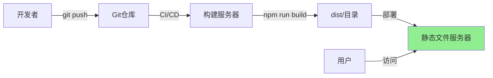
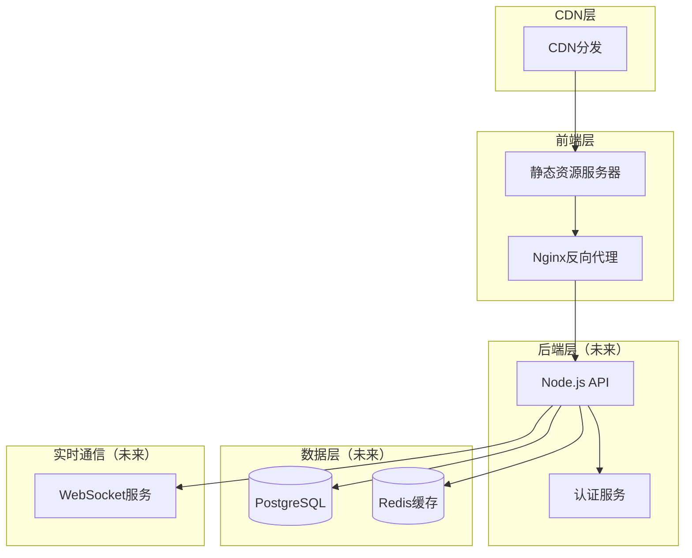

# 部署配置文档

## 概述

本文档描述了在线问诊平台（QA Live Healthcare）的部署架构、配置和流程。为 AI 模型提供必要的部署环境信息。

---

## 项目部署特点

### 当前状态

| 特性 | 说明 |
|------|------|
| **项目类型** | 纯前端 SPA（单页面应用） |
| **构建工具** | Vite 5.4.8 |
| **框架** | Vue 3.5.10 + TypeScript 5.5.3 |
| **输出产物** | 静态文件（HTML, JS, CSS） |
| **后端依赖** | 无（使用静态 JSON 数据） |
| **部署复杂度** | 低（静态文件托管即可） |

### 构建命令

```json
{
  "scripts": {
    "dev": "vite",
    "build": "vue-tsc -b && vite build",
    "preview": "vite preview"
  }
}
```

---

## 部署架构

### 简单部署架构（当前推荐）



### 生产级部署架构（未来扩展）



---

## 部署方式详解

### 方式一：静态文件托管（推荐）

适用场景：快速部署、原型演示、中小型项目

#### 1. Vercel 部署

```bash
# 安装 Vercel CLI
npm install -g vercel

# 登录
vercel login

# 部署
vercel --prod
```

**vercel.json 配置**：
```json
{
  "rewrites": [
    { "source": "/(.*)", "destination": "/index.html" }
  ],
  "headers": [
    {
      "source": "/assets/(.*)",
      "headers": [
        { "key": "Cache-Control", "value": "public, max-age=31536000, immutable" }
      ]
    }
  ]
}
```

#### 2. Netlify 部署

```bash
# 安装 Netlify CLI
npm install -g netlify-cli

# 登录
netlify login

# 部署
netlify deploy --prod
```

**netlify.toml 配置**：
```toml
[build]
  command = "npm run build"
  publish = "dist"

[[redirects]]
  from = "/*"
  to = "/index.html"
  status = 200

[[headers]]
  for = "/assets/*"
  [headers.values]
    Cache-Control = "public, max-age=31536000, immutable"
```

#### 3. GitHub Pages 部署

**创建 `.github/workflows/deploy.yml`**：
```yaml
name: Deploy to GitHub Pages

on:
  push:
    branches: [ main ]

jobs:
  build-and-deploy:
    runs-on: ubuntu-latest
    
    steps:
      - name: Checkout
        uses: actions/checkout@v4
        
      - name: Setup Node.js
        uses: actions/setup-node@v4
        with:
          node-version: '20'
          cache: 'npm'
          
      - name: Install dependencies
        run: npm ci
        
      - name: Build
        run: npm run build
        env:
          BASE_URL: /qa-live-healthcare/
          
      - name: Deploy
        uses: peaceiris/actions-gh-pages@v3
        with:
          github_token: ${{ secrets.GITHUB_TOKEN }}
          publish_dir: ./dist
```

**修改 `vite.config.ts`**：
```typescript
import { defineConfig } from 'vite'
import vue from '@vitejs/plugin-vue'

export default defineConfig({
  plugins: [vue()],
  base: process.env.BASE_URL || '/',
})
```

---

### 方式二：Docker 容器化部署

#### Dockerfile

```dockerfile
# 构建阶段
FROM node:20-alpine AS builder

WORKDIR /app

# 复制依赖文件
COPY package*.json ./

# 安装依赖
RUN npm ci

# 复制源代码
COPY . .

# 构建应用
RUN npm run build

# 生产阶段
FROM nginx:alpine

# 复制构建产物
COPY --from=builder /app/dist /usr/share/nginx/html

# 复制 Nginx 配置
COPY nginx.conf /etc/nginx/nginx.conf

# 暴露端口
EXPOSE 80

# 启动 Nginx
CMD ["nginx", "-g", "daemon off;"]
```

#### nginx.conf

```nginx
user nginx;
worker_processes auto;
error_log /var/log/nginx/error.log warn;
pid /var/run/nginx.pid;

events {
    worker_connections 1024;
}

http {
    include /etc/nginx/mime.types;
    default_type application/octet-stream;
    
    log_format main '$remote_addr - $remote_user [$time_local] "$request" '
                    '$status $body_bytes_sent "$http_referer" '
                    '"$http_user_agent" "$http_x_forwarded_for"';
    
    access_log /var/log/nginx/access.log main;
    
    sendfile on;
    tcp_nopush on;
    tcp_nodelay on;
    keepalive_timeout 65;
    gzip on;
    gzip_types text/plain text/css application/json application/javascript text/xml application/xml;
    
    server {
        listen 80;
        server_name _;
        root /usr/share/nginx/html;
        index index.html;
        
        # SPA 路由支持
        location / {
            try_files $uri $uri/ /index.html;
        }
        
        # 静态资源缓存（1年）
        location ~* ^/assets/ {
            expires 1y;
            add_header Cache-Control "public, immutable";
        }
        
        # HTML 文件不缓存
        location ~* \.html$ {
            add_header Cache-Control "no-cache, no-store, must-revalidate";
        }
        
        # Gzip 压缩
        gzip on;
        gzip_vary on;
        gzip_min_length 1024;
        gzip_types text/plain text/css text/xml text/javascript 
                   application/x-javascript application/xml+rss 
                   application/json application/javascript;
        
        # 安全头
        add_header X-Frame-Options "SAMEORIGIN" always;
        add_header X-Content-Type-Options "nosniff" always;
        add_header X-XSS-Protection "1; mode=block" always;
    }
}
```

#### docker-compose.yml

```yaml
version: '3.8'

services:
  web:
    build: .
    ports:
      - "80:80"
    restart: unless-stopped
    environment:
      - NODE_ENV=production
    healthcheck:
      test: ["CMD", "curl", "-f", "http://localhost/"]
      interval: 30s
      timeout: 10s
      retries: 3
      start_period: 10s
```

#### 构建和运行

```bash
# 构建镜像
docker build -t qa-healthcare-web:latest .

# 运行容器
docker run -d -p 80:80 --name qa-healthcare qa-healthcare-web:latest

# 使用 docker-compose
docker-compose up -d
```

---

### 方式三：Kubernetes 部署

#### 1. Deployment 配置

```yaml
# k8s/deployment.yaml
apiVersion: apps/v1
kind: Deployment
metadata:
  name: qa-healthcare-web
  namespace: production
  labels:
    app: qa-healthcare
spec:
  replicas: 3
  selector:
    matchLabels:
      app: qa-healthcare
  template:
    metadata:
      labels:
        app: qa-healthcare
    spec:
      containers:
      - name: web
        image: registry.example.com/qa-healthcare-web:latest
        ports:
        - containerPort: 80
        resources:
          requests:
            memory: "128Mi"
            cpu: "100m"
          limits:
            memory: "256Mi"
            cpu: "200m"
        livenessProbe:
          httpGet:
            path: /
            port: 80
          initialDelaySeconds: 10
          periodSeconds: 10
        readinessProbe:
          httpGet:
            path: /
            port: 80
          initialDelaySeconds: 5
          periodSeconds: 5
```

#### 2. Service 配置

```yaml
# k8s/service.yaml
apiVersion: v1
kind: Service
metadata:
  name: qa-healthcare-service
  namespace: production
spec:
  selector:
    app: qa-healthcare
  ports:
  - protocol: TCP
    port: 80
    targetPort: 80
  type: ClusterIP
```

#### 3. Ingress 配置

```yaml
# k8s/ingress.yaml
apiVersion: networking.k8s.io/v1
kind: Ingress
metadata:
  name: qa-healthcare-ingress
  namespace: production
  annotations:
    nginx.ingress.kubernetes.io/rewrite-target: /
    nginx.ingress.kubernetes.io/ssl-redirect: "true"
    cert-manager.io/cluster-issuer: "letsencrypt-prod"
spec:
  ingressClassName: nginx
  tls:
  - hosts:
    - healthcare.example.com
    secretName: healthcare-tls
  rules:
  - host: healthcare.example.com
    http:
      paths:
      - path: /
        pathType: Prefix
        backend:
          service:
            name: qa-healthcare-service
            port:
              number: 80
```

#### 4. ConfigMap（环境配置）

```yaml
# k8s/configmap.yaml
apiVersion: v1
kind: ConfigMap
metadata:
  name: qa-healthcare-config
  namespace: production
data:
  API_BASE_URL: "https://api.healthcare.example.com"
  ENVIRONMENT: "production"
```

#### 部署命令

```bash
# 创建命名空间
kubectl create namespace production

# 部署所有资源
kubectl apply -f k8s/

# 查看部署状态
kubectl get pods -n production
kubectl get services -n production
kubectl get ingress -n production

# 查看日志
kubectl logs -f deployment/qa-healthcare-web -n production
```

---

### 方式四：传统服务器部署

#### Nginx 配置

```nginx
# /etc/nginx/sites-available/healthcare.conf
server {
    listen 80;
    server_name healthcare.example.com;
    
    # 重定向到 HTTPS
    return 301 https://$server_name$request_uri;
}

server {
    listen 443 ssl http2;
    server_name healthcare.example.com;
    
    # SSL 证书
    ssl_certificate /etc/letsencrypt/live/healthcare.example.com/fullchain.pem;
    ssl_certificate_key /etc/letsencrypt/live/healthcare.example.com/privkey.pem;
    
    # SSL 配置
    ssl_protocols TLSv1.2 TLSv1.3;
    ssl_ciphers HIGH:!aNULL:!MD5;
    ssl_prefer_server_ciphers on;
    
    # 网站根目录
    root /var/www/healthcare/dist;
    index index.html;
    
    # SPA 路由支持
    location / {
        try_files $uri $uri/ /index.html;
    }
    
    # 静态资源缓存
    location ~* ^/assets/ {
        expires 1y;
        add_header Cache-Control "public, immutable";
    }
    
    # API 代理（未来使用）
    location /api/ {
        proxy_pass http://localhost:3000;
        proxy_http_version 1.1;
        proxy_set_header Upgrade $http_upgrade;
        proxy_set_header Connection 'upgrade';
        proxy_set_header Host $host;
        proxy_cache_bypass $http_upgrade;
    }
    
    # 安全头
    add_header X-Frame-Options "SAMEORIGIN" always;
    add_header X-Content-Type-Options "nosniff" always;
    add_header X-XSS-Protection "1; mode=block" always;
    add_header Strict-Transport-Security "max-age=31536000; includeSubDomains" always;
}
```

#### 部署脚本

```bash
#!/bin/bash
# deploy.sh

set -e

echo "开始部署..."

# 拉取最新代码
git pull origin main

# 安装依赖
npm ci

# 构建
npm run build

# 备份旧版本
if [ -d "/var/www/healthcare/dist" ]; then
    mv /var/www/healthcare/dist /var/www/healthcare/dist.backup.$(date +%Y%m%d%H%M%S)
fi

# 部署新版本
cp -r dist /var/www/healthcare/

# 重启 Nginx
sudo systemctl reload nginx

echo "部署完成！"
```

---

## 环境配置

### 环境变量

#### 开发环境 `.env.development`

```env
# API 配置（未来使用）
VITE_API_BASE_URL=http://localhost:3000/api

# 应用配置
VITE_APP_TITLE=在线问诊平台（开发）
VITE_APP_ENV=development
```

#### 生产环境 `.env.production`

```env
# API 配置（未来使用）
VITE_API_BASE_URL=https://api.healthcare.example.com

# 应用配置
VITE_APP_TITLE=在线问诊平台
VITE_APP_ENV=production
```

#### 更新 `vite.config.ts`

```typescript
import { defineConfig, loadEnv } from 'vite'
import vue from '@vitejs/plugin-vue'

export default defineConfig(({ mode }) => {
  const env = loadEnv(mode, process.cwd(), '')
  
  return {
    plugins: [vue()],
    base: env.BASE_URL || '/',
    define: {
      __APP_ENV__: JSON.stringify(env.VITE_APP_ENV),
    },
    build: {
      outDir: 'dist',
      sourcemap: mode !== 'production',
      minify: 'terser',
      terserOptions: {
        compress: {
          drop_console: mode === 'production',
          drop_debugger: mode === 'production',
        },
      },
    },
  }
})
```

### 在代码中使用环境变量

```typescript
// 访问环境变量
const apiUrl = import.meta.env.VITE_API_BASE_URL;
const appTitle = import.meta.env.VITE_APP_TITLE;

console.log('当前环境:', import.meta.env.VITE_APP_ENV);
```

---

## CI/CD 配置

### GitHub Actions 完整配置

```yaml
# .github/workflows/ci-cd.yml
name: CI/CD Pipeline

on:
  push:
    branches: [ main, develop ]
  pull_request:
    branches: [ main ]

jobs:
  # 构建和测试
  build:
    runs-on: ubuntu-latest
    
    steps:
      - name: Checkout code
        uses: actions/checkout@v4
        
      - name: Setup Node.js
        uses: actions/setup-node@v4
        with:
          node-version: '20'
          cache: 'npm'
          
      - name: Install dependencies
        run: npm ci
        
      - name: Type check
        run: npm run build
        
      - name: Build
        run: npm run build
        env:
          VITE_API_BASE_URL: ${{ secrets.API_BASE_URL }}
          
      - name: Upload artifact
        uses: actions/upload-artifact@v4
        with:
          name: dist
          path: dist/

  # 部署到预发布环境
  deploy-staging:
    needs: build
    runs-on: ubuntu-latest
    if: github.ref == 'refs/heads/develop'
    
    steps:
      - name: Download artifact
        uses: actions/download-artifact@v4
        with:
          name: dist
          
      - name: Deploy to staging
        run: |
          # 部署到预发布服务器
          echo "Deploying to staging..."
          
  # 部署到生产环境
  deploy-production:
    needs: build
    runs-on: ubuntu-latest
    if: github.ref == 'refs/heads/main'
    
    steps:
      - name: Download artifact
        uses: actions/download-artifact@v4
        with:
          name: dist
          
      - name: Deploy to production
        run: |
          # 部署到生产服务器
          echo "Deploying to production..."
```

---

## 性能优化

### 构建优化

#### 1. 代码分割

```typescript
// vite.config.ts
export default defineConfig({
  build: {
    rollupOptions: {
      output: {
        manualChunks: {
          'vendor': ['vue', 'vue-router'],
          'antd': ['ant-design-vue', '@ant-design/icons-vue'],
          'utils': ['dayjs'],
        },
      },
    },
    chunkSizeWarningLimit: 1000,
  },
})
```

#### 2. 压缩配置

```typescript
// vite.config.ts
import viteCompression from 'vite-plugin-compression'

export default defineConfig({
  plugins: [
    vue(),
    viteCompression({
      verbose: true,
      disable: false,
      threshold: 10240,
      algorithm: 'gzip',
      ext: '.gz',
    }),
  ],
})
```

### CDN 加速

```typescript
// vite.config.ts
export default defineConfig({
  base: 'https://cdn.example.com/healthcare/',
  build: {
    assetsDir: 'assets',
    rollupOptions: {
      output: {
        assetFileNames: 'assets/[name]-[hash][extname]',
        chunkFileNames: 'assets/[name]-[hash].js',
        entryFileNames: 'assets/[name]-[hash].js',
      },
    },
  },
})
```

---

## 监控和日志

### 前端错误监控

```typescript
// src/utils/monitor.ts
import * as Sentry from '@sentry/vue'

export function initMonitor(app: App) {
  if (import.meta.env.PROD) {
    Sentry.init({
      dsn: 'YOUR_SENTRY_DSN',
      integrations: [
        new Sentry.BrowserTracing({
          routingInstrumentation: Sentry.vueRouterInstrumentation(router),
        }),
      ],
      tracesSampleRate: 0.1,
      environment: import.meta.env.VITE_APP_ENV,
    })
  }
}

// main.ts
import { initMonitor } from './utils/monitor'
initMonitor(app)
```

### 性能监控

```typescript
// src/utils/performance.ts
export function reportWebVitals() {
  if ('PerformanceObserver' in window) {
    // 监控首次内容绘制
    const fcpObserver = new PerformanceObserver((list) => {
      const entries = list.getEntries()
      entries.forEach((entry) => {
        console.log('FCP:', entry.startTime)
      })
    })
    fcpObserver.observe({ type: 'paint', buffered: true })
    
    // 监控最大内容绘制
    const lcpObserver = new PerformanceObserver((list) => {
      const entries = list.getEntries()
      entries.forEach((entry) => {
        console.log('LCP:', entry.startTime)
      })
    })
    lcpObserver.observe({ type: 'largest-contentful-paint', buffered: true })
  }
}
```

---

## 安全配置

### 内容安全策略（CSP）

```html
<!-- index.html -->
<meta http-equiv="Content-Security-Policy" content="
  default-src 'self';
  script-src 'self' 'unsafe-inline' 'unsafe-eval' https://cdn.jsdelivr.net;
  style-src 'self' 'unsafe-inline';
  img-src 'self' data: https:;
  font-src 'self' data:;
  connect-src 'self' https://api.healthcare.example.com;
">
```

### 安全响应头

```nginx
# nginx.conf
add_header X-Frame-Options "SAMEORIGIN" always;
add_header X-Content-Type-Options "nosniff" always;
add_header X-XSS-Protection "1; mode=block" always;
add_header Referrer-Policy "strict-origin-when-cross-origin" always;
add_header Permissions-Policy "camera=(), microphone=(), geolocation=()" always;
add_header Strict-Transport-Security "max-age=31536000; includeSubDomains; preload" always;
```

---

## 备份与恢复

### 静态文件备份

```bash
#!/bin/bash
# backup.sh

BACKUP_DIR="/backup/healthcare"
DATE=$(date +%Y%m%d_%H%M%S)

# 创建备份目录
mkdir -p $BACKUP_DIR

# 备份构建产物
tar -czf $BACKUP_DIR/dist_$DATE.tar.gz dist/

# 保留最近7天的备份
find $BACKUP_DIR -name "dist_*.tar.gz" -mtime +7 -delete

echo "备份完成: dist_$DATE.tar.gz"
```

---

## 部署检查清单

### 部署前检查

- [ ] 代码已提交并通过 Code Review
- [ ] TypeScript 类型检查通过（`npm run build`）
- [ ] 构建成功，无错误
- [ ] 环境变量已正确配置
- [ ] 敏感信息未提交到代码库
- [ ] 回滚计划已准备

### 部署中检查

- [ ] 构建产物完整
- [ ] 静态资源正确上传
- [ ] Nginx/CDN 配置正确
- [ ] SSL 证书有效
- [ ] 路由重定向配置正确（SPA）
- [ ] 跨域配置正确

### 部署后检查

- [ ] 网站可访问
- [ ] 页面正常加载
- [ ] 路由跳转正常
- [ ] 静态资源加载正常
- [ ] API 调用正常（如有）
- [ ] 监控和告警正常
- [ ] 性能指标正常

---

## 故障排查

### 常见问题

#### 1. 页面刷新 404

**原因**：SPA 路由未正确配置

**解决方案**：
```nginx
location / {
    try_files $uri $uri/ /index.html;
}
```

#### 2. 静态资源 404

**原因**：路径配置错误

**解决方案**：
```typescript
// vite.config.ts
export default defineConfig({
  base: '/',  // 确保正确的基础路径
})
```

#### 3. 跨域错误

**原因**：API 请求跨域限制

**解决方案**：
```nginx
# Nginx 代理
location /api/ {
    proxy_pass http://api-server:3000;
    add_header Access-Control-Allow-Origin *;
}
```

#### 4. 缓存问题

**原因**：浏览器缓存旧版本

**解决方案**：
```nginx
# HTML 不缓存
location ~* \.html$ {
    add_header Cache-Control "no-cache, no-store, must-revalidate";
}

# JS/CSS 长期缓存（文件名包含 hash）
location ~* ^/assets/ {
    expires 1y;
    add_header Cache-Control "public, immutable";
}
```

### 日志查看

```bash
# Nginx 访问日志
tail -f /var/log/nginx/access.log

# Nginx 错误日志
tail -f /var/log/nginx/error.log

# Docker 日志
docker logs -f qa-healthcare-web

# Kubernetes 日志
kubectl logs -f deployment/qa-healthcare-web -n production
```

---

## 未来扩展

### 后端 API 部署（规划中）

```yaml
# docker-compose.full.yml（未来使用）
version: '3.8'

services:
  web:
    build: .
    ports:
      - "80:80"
    depends_on:
      - api
      
  api:
    build: ./api
    ports:
      - "3000:3000"
    environment:
      - DATABASE_URL=postgresql://user:pass@db:5432/healthcare
      - REDIS_URL=redis://redis:6379
    depends_on:
      - db
      - redis
      
  db:
    image: postgres:15-alpine
    environment:
      - POSTGRES_DB=healthcare
      - POSTGRES_USER=user
      - POSTGRES_PASSWORD=pass
    volumes:
      - postgres_data:/var/lib/postgresql/data
      
  redis:
    image: redis:7-alpine
    volumes:
      - redis_data:/data

volumes:
  postgres_data:
  redis_data:
```

---

## 快速部署指南

### 最快部署方式（Vercel）

```bash
# 1. 安装 CLI
npm install -g vercel

# 2. 登录
vercel login

# 3. 部署
vercel --prod

# 完成！
```

### Docker 快速部署

```bash
# 1. 构建镜像
docker build -t qa-healthcare .

# 2. 运行容器
docker run -d -p 80:80 qa-healthcare

# 3. 访问
open http://localhost
```

---

## 参考资料

### 官方文档
- [Vite 部署指南](https://vitejs.dev/guide/static-deploy.html)
- [Vue.js 部署文档](https://vuejs.org/guide/best-practices/production-deployment.html)
- [Nginx 官方文档](https://nginx.org/en/docs/)

### 部署平台
- [Vercel](https://vercel.com/)
- [Netlify](https://www.netlify.com/)
- [GitHub Pages](https://pages.github.com/)

### 工具
- [Docker](https://www.docker.com/)
- [Kubernetes](https://kubernetes.io/)
- [GitHub Actions](https://github.com/features/actions)

---

*本部署文档应在部署配置变更时更新。使用 `/asdm-context-update` 命令保持文档时效性。*
